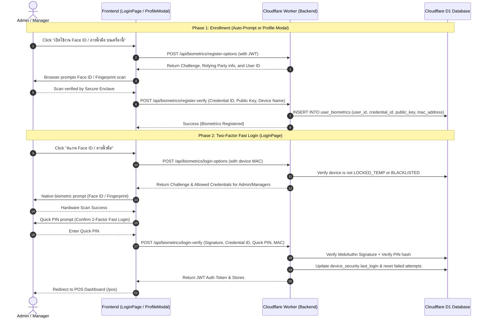

# 📱 Admin/Manager Two-Factor Biometric Authentication (Face ID & Fingerprint) Plan

> **For agentic workers:** REQUIRED SUB-SKILL: Use superpowers:subagent-driven-development (recommended) or superpowers:executing-plans to implement this plan task-by-task. Steps use checkbox (`- [ ]`) syntax for tracking.

**Goal:** Implement a secure, enterprise-grade Biometric Authentication system (Face ID, Touch ID, Android Fingerprint, Windows Hello) using the W3C WebAuthn standard for **Store Owners, Admins, and Managers**, featuring a **Two-Factor Fast Login (Biometrics + Quick PIN)** to prevent unauthorized account takeover on shared store tablets.

**Architecture:**
- **Frontend Runtime:** React (Vite PWA) over HTTPS on port 5174 using native browser `PublicKeyCredential` (WebAuthn).
- **Backend Runtime:** Express on Cloudflare Workers (`pos-backend.bragill2012.workers.dev`) using native Web Cryptography (`crypto.subtle`).
- **Database:** Cloudflare D1 (`pos_system`) storing registered public keys and counter records.
- **Security Integration:** Adheres strictly to the existing MAC address device security, temporary lockout timers (`LOCKED_TEMP`), and blacklist protection (`BLACKLISTED`).

---

## 🧭 Key Architectural Decisions (Aligned via Grill-Me)

| Dimension | Decision | Rationale |
| :--- | :--- | :--- |
| **Target Users** | **Admin / Manager Only** | Cashiers on shared counter terminals continue using their private **6-digit PIN** to eliminate impersonation risks and avoid mobile OS single-face limitations. |
| **Enrollment Channel** | **Auto-Prompt + Standalone Profile Modal** | When an Admin logs in, a non-intrusive prompt asks to enable biometrics. Admins can also manage biometrics in a lightweight **"My Profile & Biometrics" modal** without touching sensitive store/system settings. |
| **Shared Tablet Security** | **Two-Factor Fast Login (Biometrics + Quick PIN)** | Scanning Face/Fingerprint confirms hardware presence and identifies the account, followed by a fast PIN confirmation to prevent coworkers from tapping another manager's name. |
| **Device Security** | **Unified with MAC Security** | Biometric login requests pass the device's MAC address; locked or blacklisted devices are strictly blocked (HTTP 429/403). |

---

## 🏗️ Architecture & Interaction Flow



---

## 🗄️ Database Schema: Cloudflare D1 Migration

Add `user_biometrics` table to Cloudflare D1:

```sql
CREATE TABLE IF NOT EXISTS user_biometrics (
  id TEXT PRIMARY KEY,
  user_id TEXT NOT NULL,
  mac_address TEXT,
  credential_id TEXT NOT NULL UNIQUE,
  public_key TEXT NOT NULL,
  algorithm TEXT DEFAULT 'ES256',
  counter INTEGER DEFAULT 0,
  device_name TEXT,
  created_at TEXT DEFAULT (datetime('now', '+7 hours')),
  last_used_at TEXT,
  FOREIGN KEY (user_id) REFERENCES users(id) ON DELETE CASCADE
);

CREATE INDEX IF NOT EXISTS idx_user_biometrics_user ON user_biometrics(user_id);
CREATE INDEX IF NOT EXISTS idx_user_biometrics_cred ON user_biometrics(credential_id);
CREATE INDEX IF NOT EXISTS idx_user_biometrics_mac ON user_biometrics(mac_address);
```

---

## 📋 Actionable Implementation Tasks

### Task 1: Database Migration (Cloudflare D1)
- [ ] **Step 1:** Create migration file `POS_Project/backend/src/database/migrations/005_user_biometrics.sql`.
- [ ] **Step 2:** Apply table creation to remote Cloudflare D1 database:
  ```powershell
  npx wrangler d1 execute pos_system --remote --command="CREATE TABLE IF NOT EXISTS user_biometrics (id TEXT PRIMARY KEY, user_id TEXT NOT NULL, mac_address TEXT, credential_id TEXT NOT NULL UNIQUE, public_key TEXT NOT NULL, algorithm TEXT DEFAULT 'ES256', counter INTEGER DEFAULT 0, device_name TEXT, created_at TEXT DEFAULT (datetime('now', '+7 hours')), last_used_at TEXT);"
  ```
- [ ] **Step 3:** Verify table creation in D1 using `SELECT name FROM sqlite_master WHERE type='table'`.

---

### Task 2: Backend WebAuthn Service & Routes
**Files:**
- Create: `POS_Project/backend/src/routes/biometrics.js`
- Modify: `POS_Project/backend/src/app.js`

- [ ] **Step 1: Implement WebAuthn helper & verification in backend**
  - Use native `crypto.subtle` (zero extra dependencies for Cloudflare Workers compatibility).
  - Support ES256 (COSE algorithm -7) and RS256 (COSE -257).
  - Challenge generation with 60-second TTL.
- [ ] **Step 2: Implement registration endpoints**
  - `POST /api/biometrics/register-options`: Validates caller is Admin/Manager (via JWT), generates 32-byte challenge.
  - `POST /api/biometrics/register-verify`: Stores `credential_id`, `public_key`, and binds device MAC.
- [ ] **Step 3: Implement login endpoints with Two-Factor PIN validation**
  - `POST /api/biometrics/login-options`: Checks device security status (`LOCKED_TEMP`, `BLACKLISTED`), returns active Admin/Manager credential descriptors.
  - `POST /api/biometrics/login-verify`: Validates signature against stored public key, validates user PIN, resets failed attempts, and returns JWT session token.
- [ ] **Step 4: Implement credential management**
  - `GET /api/biometrics/my-credentials`: Lists active credentials for authenticated user.
  - `DELETE /api/biometrics/credentials/:id`: Deletes specific credential.
- [ ] **Step 5: Register router in `app.js`**
  - Mount at `/api/biometrics`.
- [ ] **Step 6: Deploy and test backend endpoints**
  - Deploy to Cloudflare Workers via `npx wrangler deploy`.

---

### Task 3: Frontend WebAuthn Utilities
**Files:**
- Create: `POS_Project/frontend/src/utils/webAuthnHelper.js`
- Modify: `POS_Project/frontend/src/services/api.js`

- [ ] **Step 1: Create `webAuthnHelper.js`**
  - `isBiometricsAvailable()`: Checks `window.PublicKeyCredential && PublicKeyCredential.isUserVerifyingPlatformAuthenticatorAvailable()`.
  - Base64URL to ArrayBuffer and ArrayBuffer to Base64URL encoders.
  - `startRegistration(options)`: Wrapper around `navigator.credentials.create()`.
  - `startAuthentication(options)`: Wrapper around `navigator.credentials.get()`.
- [ ] **Step 2: Add `biometricsAPI` to `api.js`**
  - Define `getRegisterOptions`, `verifyRegistration`, `getLoginOptions`, `verifyLogin`, `getMyCredentials`, `removeCredential`.

---

### Task 4: Frontend UI (Profile Modal & Login Flow)
**Files:**
- Create: `POS_Project/frontend/src/components/BiometricsProfileModal.jsx`
- Modify: `POS_Project/frontend/src/pages/LoginPage.jsx`
- Modify: `POS_Project/frontend/src/components/Layout.jsx`

- [ ] **Step 1: Create `BiometricsProfileModal.jsx`**
  - Clean modal accessible from user avatar in `Layout.jsx` (top navigation bar).
  - Displays device biometric support status (Face ID / Fingerprint / Windows Hello).
  - List of currently registered credentials with deletion option.
  - One-click button: `➕ เปิดใช้งาน Face ID / ลายนิ้วมือ บนเครื่องนี้`.
- [ ] **Step 2: Add post-login prompt for Admin/Manager**
  - If user has `role === 'admin' || role === 'manager'`, device supports biometrics, and no credential registered yet on this device, show a subtle prompt toast/modal to register.
- [ ] **Step 3: Update `LoginPage.jsx`**
  - Add biometric login button when biometrics is supported on client:
    `🧬 สแกน Face ID / ลายนิ้วมือ (ผู้จัดการ/แอดมิน)`.
  - On click: Trigger native biometric prompt ➡️ On success, prompt 4-digit quick PIN ➡️ Log in to POS immediately.
  - Strictly disable button if `deviceStatus.locked` is active.

---

### Task 5: Testing & Verification
- [ ] **Step 1: Verify Build Integrity**
  - `npm run build` in `POS_Project/frontend`.
- [ ] **Step 2: Cloudflare Deployment Verification**
  - `npx wrangler deploy` in `POS_Project/backend`.
- [ ] **Step 3: Verification Matrix**
  - [ ] Windows Hello / Touch ID registration and login.
  - [ ] Mobile iOS Safari Face ID / Touch ID prompt test.
  - [ ] Mobile Android Fingerprint prompt test.
  - [ ] Verify Cashier account cannot register biometrics and is instructed to use PIN.
  - [ ] Verify device lockout (`LOCKED_TEMP`) correctly disables biometric login.
