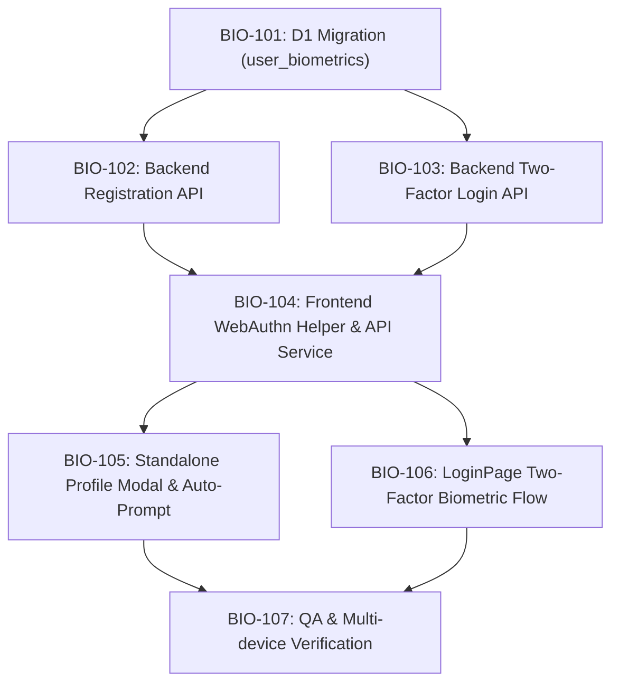

# 🎫 Engineering Tickets: Two-Factor Biometric Authentication (Epic: BIO-01)

| Metadata | Details |
| :--- | :--- |
| **Epic ID** | `EPIC-BIO-01` |
| **Epic Title** | Admin/Manager Two-Factor Biometric Authentication (Face ID / Fingerprint + Quick PIN) |
| **Target Branch** | `feat/biometric-login` |
| **Specification Ref** | [`docs/superpowers/specs/2026-09-18-biometric-admin-auth-spec.md`](file:///E:/Project/POS_2.0/POS/docs/superpowers/specs/2026-09-18-biometric-admin-auth-spec.md) |
| **Implementation Plan Ref** | [`docs/superpowers/plans/2026-09-18-biometric-admin-auth.md`](file:///E:/Project/POS_2.0/POS/docs/superpowers/plans/2026-09-18-biometric-admin-auth.md) |
| **Status** | Ready for Sprint Execution |

---

## 🗺️ Ticket Dependency Graph

---

### [BIO-101] Cloudflare D1 Migration for `user_biometrics` ✅ (Completed)
- **Type**: Task
- **Priority**: P0 (Blocker)
- **Complexity**: 2 SP
- **Status**: Completed
- **Files Affected**:
  - `POS_Project/backend/src/database/migrations/005_user_biometrics.sql`
  - `POS_Project/backend/src/database/migrate.js`
  - `POS_Project/backend/src/database/schema_d1.sql`
- **Description**:
  Create and execute table migration in Cloudflare D1 to store platform authenticator credentials bound to users and device MAC addresses.
- **Implementation Checklist**:
  - [x] Write SQL migration with fields: `id`, `user_id`, `mac_address`, `credential_id`, `public_key`, `algorithm`, `counter`, `device_name`, `created_at`, `last_used_at`.
  - [x] Add indexes on `user_id`, `credential_id`, and `mac_address`.
  - [x] Execute against remote D1 database via `npx wrangler d1 execute pos_system --remote`.
- **Acceptance Criteria**:
  - [x] `SELECT name FROM sqlite_master WHERE type='table' AND name='user_biometrics'` returns 1 row in remote D1.

---

### [BIO-102] Backend WebAuthn Registration Endpoints ✅ (Completed)
- **Type**: Feature
- **Priority**: P0
- **Complexity**: 5 SP
- **Status**: Completed
- **Files Affected**:
  - `POS_Project/backend/src/routes/biometrics.js` (NEW)
  - `POS_Project/backend/src/app.js` (MODIFY)
  - `POS_Project/backend/tests/biometrics_registration.test.js` (NEW - TDD Test Suite)
- **Description**:
  Implement challenge generation and public key registration endpoints for Admin and Manager roles using native Web Cryptography (`crypto.subtle`).
- **Implementation Checklist**:
  - [x] Implement `POST /api/biometrics/register-options`:
    - Requires authenticated user (`authenticate` middleware).
    - Checks role is `admin` or `manager`. Non-admins receive `403 Forbidden`.
    - Generates 32-byte secure random challenge, returns Relying Party and user descriptors.
  - [x] Implement `POST /api/biometrics/register-verify`:
    - Validates payload and extracts `credentialId` and `publicKey` (ES256 / RS256).
    - Inserts credential into `user_biometrics` table.
  - [x] Implement `GET /api/biometrics/my-credentials` & `DELETE /api/biometrics/credentials/:id`.
  - [x] Mount route in `app.js`.
  - [x] Verify with 6/6 passing TDD automated unit tests (`npm test`).
  - [x] Deploy to Cloudflare Workers (`npx wrangler deploy`).
- **Acceptance Criteria**:
  - [x] Given an authenticated Admin, when calling `/api/biometrics/register-options`, a valid WebAuthn options payload with a random challenge is returned.
  - [x] Given a Cashier account, calling the endpoint returns `403: เฉพาะผู้จัดการหรือผู้ดูแลระบบเท่านั้นที่สามารถลงทะเบียนชีวมาตรได้`.

---

### [BIO-103] Backend Two-Factor Biometric Login Endpoint
- **Type**: Feature
- **Priority**: P0
- **Complexity**: 5 SP
- **Files Affected**:
  - `POS_Project/backend/src/routes/biometrics.js`
  - `POS_Project/backend/src/routes/auth.js`
- **Description**:
  Implement pre-login biometric authentication that validates the cryptographic signature from the hardware enclave, checks the Quick PIN, and enforces device security rules.
- **Implementation Checklist**:
  - [x] Implement `POST /api/biometrics/login-options`:
    - Accepts device MAC address in header/body.
    - Validates device security: If `status === 'LOCKED_TEMP'` or `'BLACKLISTED'`, returns 429/403 immediately.
    - Fetches allowed credential IDs for this MAC address belonging to Admin/Manager accounts.
  - [x] Implement `POST /api/biometrics/login-verify`:
    - Checks MAC address status again.
    - Validates WebAuthn signature using stored `public_key` with `crypto.subtle.verify`.
    - Validates 4-digit `quick_pin` against user's bcrypt password/PIN hash.
    - On PIN failure: Increments `failed_attempts` on `device_security` (locks device on 5th attempt).
    - On success: Resets `failed_attempts`, updates `last_used_at`, and issues JWT token with assigned stores.
  - [x] Verify with 6/6 automated TDD tests (`npm test`).
  - [x] Deploy to Cloudflare Workers (`npx wrangler deploy`).
- **Acceptance Criteria**:
  - [x] A valid biometric assertion + correct Quick PIN logs in and returns a valid JWT token.
  - [x] An invalid signature or incorrect PIN is rejected with an error and increments device failed attempts.
  - [x] A device in `LOCKED_TEMP` is rejected with 429 and countdown timer.

---

### [BIO-104] Frontend WebAuthn Helper & API Service
- **Type**: Task
- **Priority**: P0
- **Complexity**: 3 SP
- **Files Affected**:
  - `POS_Project/frontend/src/utils/webAuthnHelper.js` (NEW)
  - `POS_Project/frontend/src/services/api.js` (MODIFY)
- **Description**:
  Build client-side WebAuthn wrapper utilities to interact with browser native platform authenticators and encode binary payloads.
- **Implementation Checklist**:
  - [x] `isBiometricsAvailable()`: Checks `PublicKeyCredential.isUserVerifyingPlatformAuthenticatorAvailable()`.
  - [x] `base64URLToBuffer` and `bufferToBase64URL` binary encoders.
  - [x] `startBiometricRegistration(options)`: Wrapper for `navigator.credentials.create()`.
  - [x] `startBiometricAuthentication(options)`: Wrapper for `navigator.credentials.get()`.
  - [x] Add `biometricsAPI` methods to `api.js`.
  - [x] Unit test suite created and passing (`src/utils/webAuthnHelper.test.js`).
  - [x] Verified with production frontend build (`npm run build`).
- **Acceptance Criteria**:
  - [x] Helper functions handle cross-browser binary formatting cleanly without throwing unhandled exceptions.

---

### [BIO-105] Standalone Biometrics Profile Modal & Post-Login Prompt
- **Type**: Feature
- **Priority**: P1
- **Complexity**: 4 SP
- **Files Affected**:
  - `POS_Project/frontend/src/components/BiometricsProfileModal.jsx` (NEW)
  - `POS_Project/frontend/src/components/Layout.jsx` (MODIFY)
- **Description**:
  Create a standalone modal accessible from the top navbar avatar to manage biometrics, plus a subtle prompt for Admin/Manager after login on an unregistered device.
- **Implementation Checklist**:
  - [ ] Create `BiometricsProfileModal.jsx`:
    - Shows device capability status (supported vs unsupported).
    - Lists active enrolled credentials with Device Name, Enrolled Date, and Delete action.
    - One-click button: `➕ เปิดใช้งาน Face ID / ลายนิ้วมือ บนเครื่องนี้`.
  - [ ] Connect modal trigger to user avatar / profile button in `Layout.jsx`.
  - [ ] Implement post-login prompt:
    - If user is Admin/Manager and current device is not yet registered, display a toast/banner:
      *"ต้องการเปิดใช้งาน Face ID / ลายนิ้วมือ สำหรับ [ชื่อ] บนเครื่องนี้หรือไม่?"*
- **Acceptance Criteria**:
  - Admin/Manager can open the modal, see registered devices, register the current device, or revoke older devices.
  - Cashier users do not see biometric enrollment options.

---

### [BIO-106] Two-Factor Biometric Sign-In on `LoginPage.jsx`
- **Type**: Feature
- **Priority**: P0
- **Complexity**: 5 SP
- **Files Affected**:
  - `POS_Project/frontend/src/pages/LoginPage.jsx` (MODIFY)
- **Description**:
  Add biometric sign-in button and 2FA Quick PIN dialog to `LoginPage.jsx` while strictly respecting device security locks.
- **Implementation Checklist**:
  - [ ] If `isBiometricsAvailable()` is true, display biometric option:
    `🧬 สแกน Face ID / ลายนิ้วมือ (ผู้จัดการ)`.
  - [ ] On click:
    - Call `biometricsAPI.getLoginOptions({ mac_address })`.
    - Trigger `navigator.credentials.get()`.
    - Upon biometric success, open Quick PIN modal (4 digits).
    - Call `biometricsAPI.verifyLogin({ ..., quick_pin })`.
    - On success: Store token and redirect to `/pos`.
  - [ ] Security locks:
    - If `deviceStatus.locked` is true, disable button completely.
- **Acceptance Criteria**:
  - Tapping the biometric button opens the device's native Face ID / Fingerprint sheet.
  - After scanning, entering the Quick PIN immediately logs the manager into the POS.
  - If the device is locked (`LOCKED_TEMP`), the button is disabled and displays the countdown timer.

---

### [BIO-107] Multi-Device QA & Security Verification
- **Type**: QA / Testing
- **Priority**: P0
- **Complexity**: 3 SP
- **Files Affected**:
  - All touched files
- **Description**:
  Perform end-to-end integration and security validation across mobile and desktop environments.
- **Verification Matrix**:
  - [ ] **Desktop (Windows Hello / Mac Touch ID)**: Successful enrollment, sign-in, and revocation.
  - [ ] **iOS Safari / PWA (iPhone / iPad)**: Face ID / Touch ID prompt triggers natively.
  - [ ] **Android Chrome / PWA**: Fingerprint / BiometricPrompt triggers natively.
  - [ ] **Role Isolation**: Verify Cashier accounts are prevented from enrolling and instructed to use their 6-digit PIN.
  - [ ] **Brute-force Lockout Test**: Entering wrong Quick PIN 5 times activates 5-minute `LOCKED_TEMP` across all login methods.
  - [ ] **Cloudflare Production Deployment**: Verify clean build and deployment with `npx wrangler deploy`.
